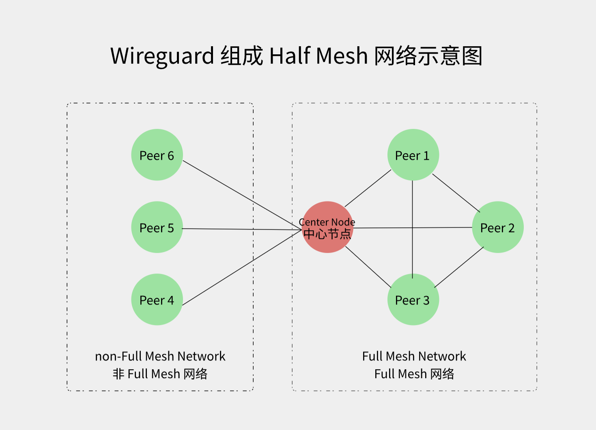

# Fast Full Mesh Plugin

[中文版](README.md)

A WGDashboard plugin for automatically generating WireGuard configurations (Half Mesh) and centralized management.

## Features

- Tag-based automated configuration, no UI required, all operations completed within WGDashboard.
- Supports full-node Full Mesh, and also supports selecting one node from full-mesh nodes to connect to other peers (non-Full Mesh nodes), forming a Half Mesh network with full-node interconnection.
- Clients actively subscribe to configurations, achieving unified centralized configuration management.

## Installation and Deployment

1. Copy the `fast_fullmesh` folder to the WGDashboard plugins directory
2. Set the system environment variable `FAST_FULLMESH_SECRET` for API encryption
3. Restart WGDashboard
4. Use `Nginx` or another reverse proxy to enable `https`, preventing secret key transmission in plain text.
5. Find the corresponding client script from `client_script` and follow the instructions.

**WARNING: By default, the device deploying WGDashboard itself is one of the WireGuard network nodes (hereinafter referred to as the main node, different from the center node), and it must be a Full Mesh network node.**



## Tag Descriptions

- `full-mesh`: Makes the node participate in the Full Mesh network. If the node has this tag, it will establish bidirectional connections with all other tagged nodes. This tag can exist on multiple nodes, and the main node has it by default.
- `endpoint%ipv4:port` or `endpoint%ipv4:port,ipv6:port`: Custom endpoint configuration, used to override the default endpoint address. Supports IPv4 and IPv6 addresses. All `full-mesh` nodes should have their own unique `endpoint` tag.
- `ipv6`: Indicates that the node only supports IPv6 connections. In this case, the node can use the `endpoint%ipv6:port` tag, while other nodes should use `endpoint%ipv4:port,ipv6:port`. Because IPv4 connection is the default.
- `center`: Marks the node as the center node. This tag is unique. If no node has the `center` tag, the main node is used as the center node by default.
- `xTo%节点名`: Deprecated.

## Functionality Introduction

### [Interface]

1. `Address`: Field comes from `Allowed IPs`; for the node deploying WGDashboard (main node), the field comes from `IP Address/Prefix Length`, and modifies the subnet mask to `/32`.

*If you set the main node's `IP Address/Prefix Length` to `IP/32`, WGDashboard will not be able to add nodes normally, which is why I made this special handling.*

2. `PrivateKey`, `DNS`, `MTU`, `ListenPort`: All come from the same WGDashboard configuration.

### [Peer]

Before starting, let's explain the WireGuard network logic. WireGuard automatically intercepts all traffic in the `AllowedIPs` configuration on the current node device, i.e., outbound traffic, sending it to the current `Peer` node. WireGuard does not distinguish between Server and Client in its design, supports multiple `Peers`, and naturally supports Mesh interconnection and hybrid connections (as long as routing logic is correct).

1. `Peer Count 1`: Assuming the total number of nodes marked with the **`full-mesh`** tag (main node by default) is `N`, the number of [Peer] blocks in its configuration should be `N-1`, i.e., fully interconnected.

2. `Peer Count 2`: If the current node is marked with the **`center`** tag (if no tag, default is main node), i.e., the **center node**, its configuration's [Peer] blocks should include peer blocks for all non-Full Mesh nodes.

3. `Peer Count 3`: If the current node **does not** have the **`full-mesh`** tag, i.e., a **non-Full Mesh node**, its configuration's [Peer] blocks should **only include** the peer block for the center node.

4. `Endpoint`: Main node comes from configuration `Endpoint Address`, other endpoints come from tags **`endpoint%ipv4:port`** or **`endpoint%ipv4:port,ipv6:port`**.

5. `AllowedIPs`: For `Full Mesh nodes`, comes from each peer node's `Endpoint Allowed IPs`; for the center node, also add all non-Full Mesh nodes' IPs to ensure traffic penetrates normally. For `non-Full Mesh nodes`, fill with the union of all `Endpoint Allowed IPs`.

6. `PublicKey`, `PersistentKeepalive`: All come from the same WGDashboard configuration, `PresharedKey` shared keys are not supported yet.

*This section only explains principles. If you don't understand the logic, it's okay.*

## File Structure

```
fast_fullmesh/
├── main.py                  # Plugin entry, HTTP server
├── modules/
│   ├── config_generator.py  # Configuration generation core logic
│   ├── tag_parser.py        # PeerGroups tag parsing
│   └── utils.py             # Utility functions (logging, safe access)
├── client_script/           # Client automated subscription plugin
└── README.md
```

## API Interface

**Example (for testing only):**
```bash
curl "http://serverIP:18889/?peername=********&config=********&secret=********" > wg0.conf
```

For formal use, `https` should be enabled to avoid transmitting secrets in plain text over the public network.

## Thanks

- Thanks to `ChenYFan` for providing ideas and the original project: [EasyWGSync](https://github.com/ChenYFan/EasyWGSync)
- Thanks to the `WGDashboard` plugin platform: [WGDashboard-Plugins](https://github.com/WGDashboard/WGDashboard-Plugins)